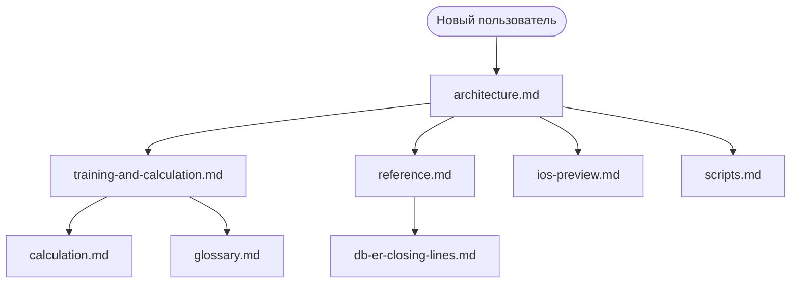
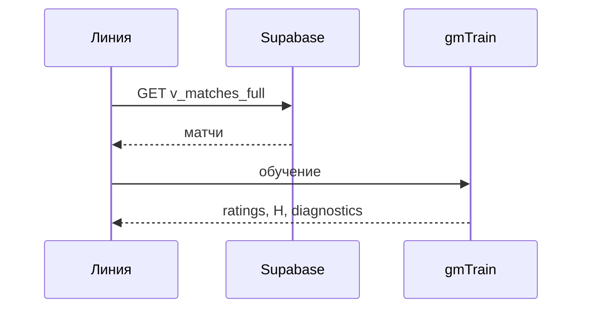

# Документация FairOddsCalc

Техническая документация desktop + web/iOS + Supabase.  
Документы сверены с кодом в `app/` и `web/FairOddsCalc_iOS.html` (ветка актуальной разработки).

---

## Карта документов



---

## Порядок чтения

| # | Документ | Содержание |
|---|----------|------------|
| 1 | [architecture.md](architecture.md) | компоненты, web vs desktop, **диаграмма PNG**, sequence-диаграммы |
| 2 | [reference.md](reference.md) | REST API, UI↔БД, PATCH whitelist |
| 3 | [calculation.md](calculation.md) | формулы (краткий справочник) |
| 4 | [training-and-calculation.md](training-and-calculation.md) | **подробное** обучение и прогноз, pipeline, FAQ |
| 5 | [db-er-closing-lines.md](db-er-closing-lines.md) | **фактическая** ER-схема Supabase |
| 6 | [glossary.md](glossary.md) | термины |
| 7 | [ios-preview.md](ios-preview.md) | GitHub Pages / LAN |
| 8 | [scripts.md](scripts.md) | bash-скрипты |

---

## Быстрые ссылки по темам

| Тема | Где читать |
|------|------------|
| Вес матча `w_base` | [calculation.md §3](calculation.md), [training §Шаг 3](training-and-calculation.md) |
| Дерби → H, не вес | [calculation.md §3–4](calculation.md), [db-er §4](db-er-closing-lines.md) |
| Defaults web `baseline` | [training §6](training-and-calculation.md), [architecture §7](architecture.md) |
| PATCH истории | [reference.md](reference.md) |
| Ключи команд по id | [reference.md](reference.md), [architecture §3](architecture.md) |
| LAN / iPhone | [ios-preview.md](ios-preview.md), [scripts.md](scripts.md) |

---

## Примеры данных

| Файл | Назначение |
|------|------------|
| [examples/closing_lines_serie_a_sample.csv](examples/closing_lines_serie_a_sample.csv) | CLI `goal_model_train.py` (legacy без team id) |
| [examples/history_epl_2025_26.csv](examples/history_epl_2025_26.csv) | тесты Shin / истории |
| [examples/season_odds_la_liga_2024_25.csv](examples/season_odds_la_liga_2024_25.csv) | пример сезонной таблицы |

> **Основной источник в приложении — Supabase**, не CSV.  
> Web «Линия» загружает матчи **только из БД**.  
> Файл `examples/matches.csv` — **legacy** схема рейтинга (не closing-линии).

---

## Код

| Путь | Описание |
|------|----------|
| `app/fair_odds_calc.py` | desktop |
| `web/FairOddsCalc_iOS.html` | web / iOS |
| `app/supabase_history.py` | клиент истории |
| `app/goal_model_train.py` | обучение (Python) |
| `tests/test_doc_mappings.py` | тесты согласованности docs ↔ code |

```bash
python3 -m pytest tests/test_doc_mappings.py tests/test_goal_model.py -q
```

---

## Диаграммы

В документации используются **Mermaid**-диаграммы (flowchart, sequence, ER).  
GitHub и многие Markdown-просмотрщики рендерят их автоматически.

Пример — обучение:



Полная версия: [architecture.md §3](architecture.md).
