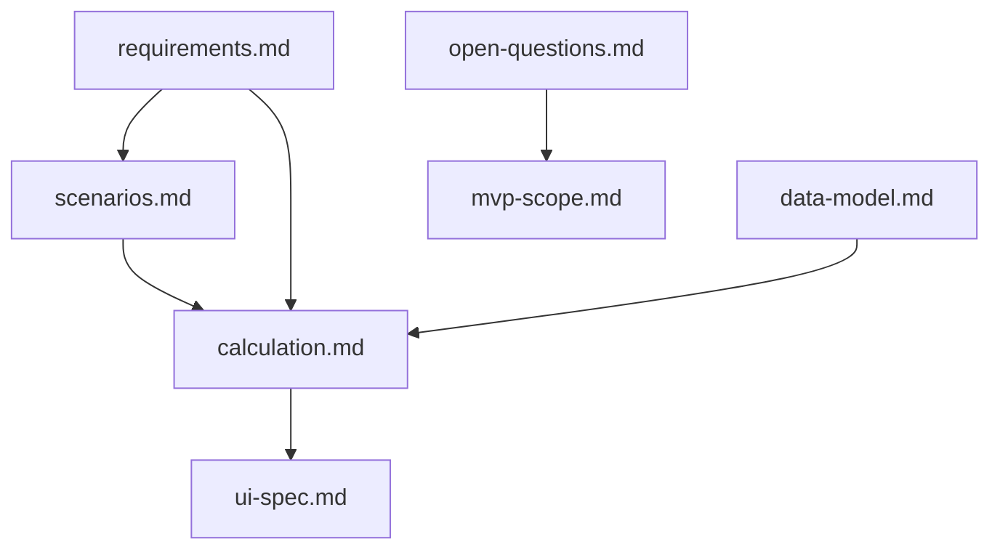

# Документация: калькулятор честных коэффициентов

Пакет технической документации для десктоп-приложения расчёта «честных» футбольных коэффициентов на исходы **P1 / X / P2** (победа хозяев / ничья / победа гостей).

**Статус:** только документация. Прикладной код и выбор GUI-фреймворка — после согласования (см. [mvp-scope.md](mvp-scope.md)).

## Порядок чтения

1. [glossary.md](glossary.md) — термины и определения.
2. [requirements.md](requirements.md) — цели, сценарии 1 и 2, пользовательские потоки.
3. [scenarios.md](scenarios.md) — выбор сценария, критерии общего соперника, надёжность.
4. [data-model.md](data-model.md) — сущности, импорт, валидация.
5. [calculation.md](calculation.md) — формулы с нуля, примеры, псевдокод.
6. [ui-spec.md](ui-spec.md) — экраны десктопа MVP.
7. [mvp-scope.md](mvp-scope.md) — границы первой версии кода.
8. [open-questions.md](open-questions.md) — нерешённое и принятые допущения.

## Карта зависимостей

## Примеры данных

Каталог [examples/](examples/):

| Файл | Назначение |
|------|------------|
| [matches.csv](examples/matches.csv) | Матчи, коэффициенты, closing, derby |
| [team_strength.csv](examples/team_strength.csv) | Рыночный удельный вес |
| [venue_factors.csv](examples/venue_factors.csv) | Поправки дом / выезд / нейтраль |
| [flip_rules.csv](examples/flip_rules.csv) | Правила перевертышей (сценарий 2) |

## Связанные документы

| Документ | Содержание |
|----------|------------|
| [glossary.md](glossary.md) | Словарь |
| [requirements.md](requirements.md) | Требования |
| [scenarios.md](scenarios.md) | Сценарии 1/2 и логика выбора |
| [data-model.md](data-model.md) | Модель данных |
| [calculation.md](calculation.md) | Расчёты |
| [ui-spec.md](ui-spec.md) | UI |
| [mvp-scope.md](mvp-scope.md) | Объём MVP |
| [open-questions.md](open-questions.md) | Открытые вопросы |
