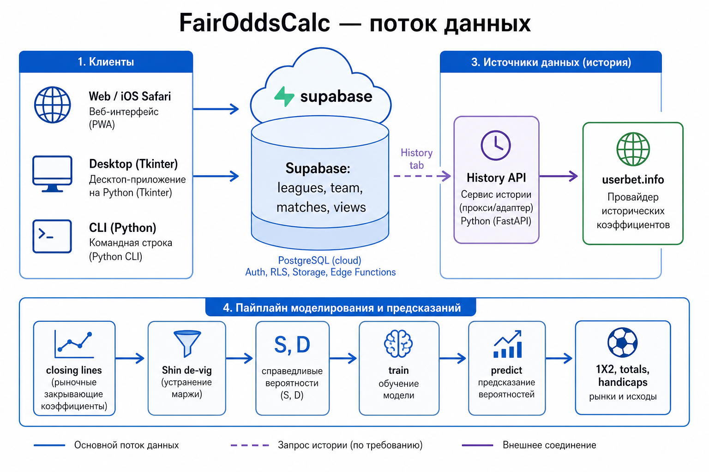
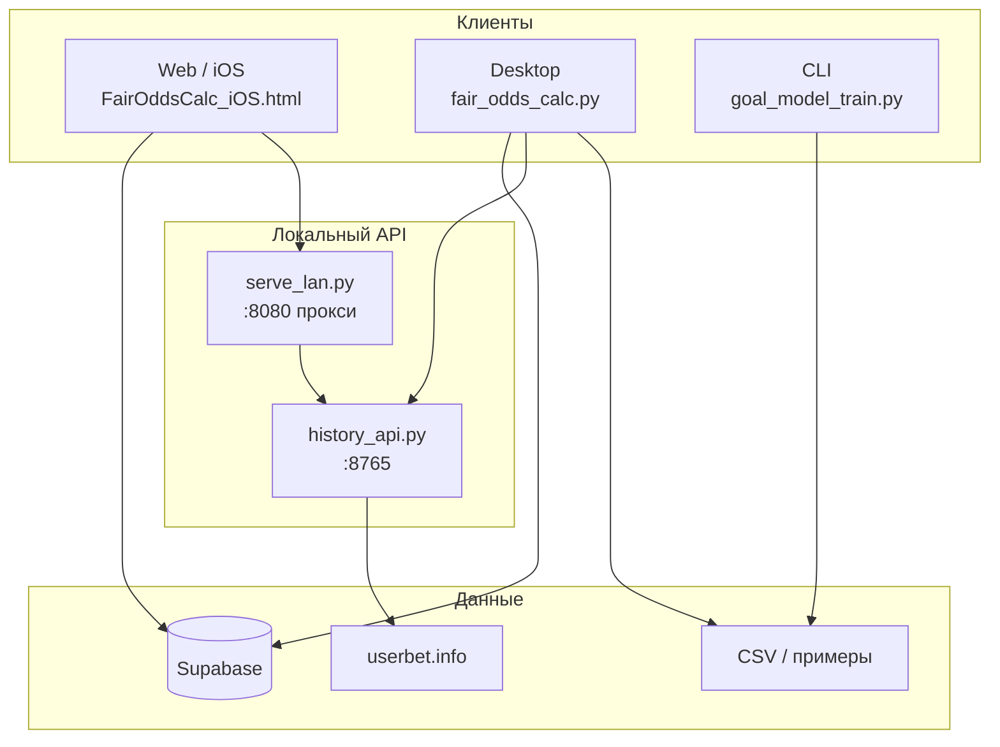
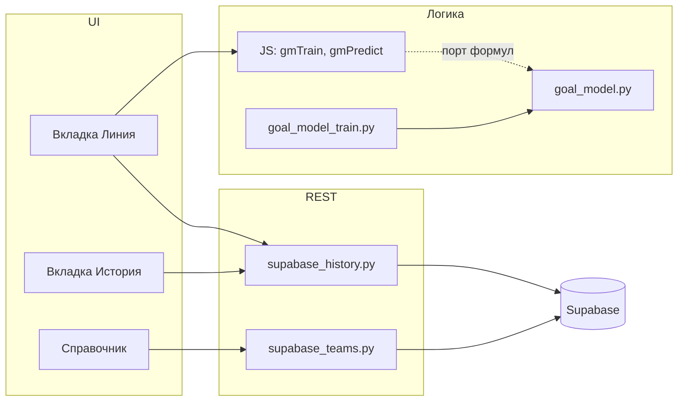
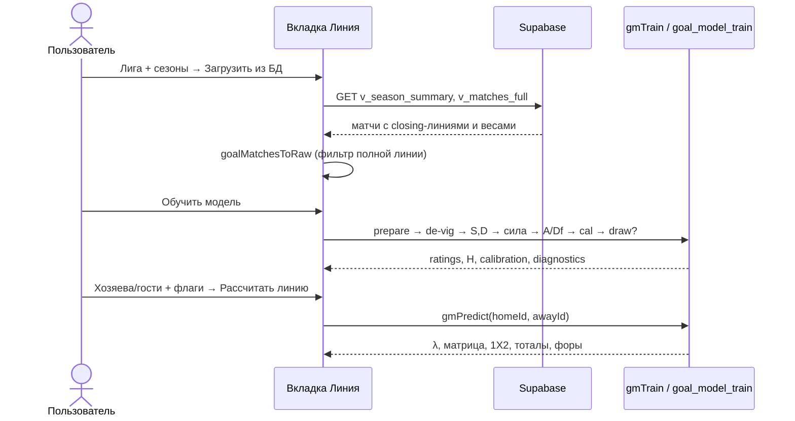
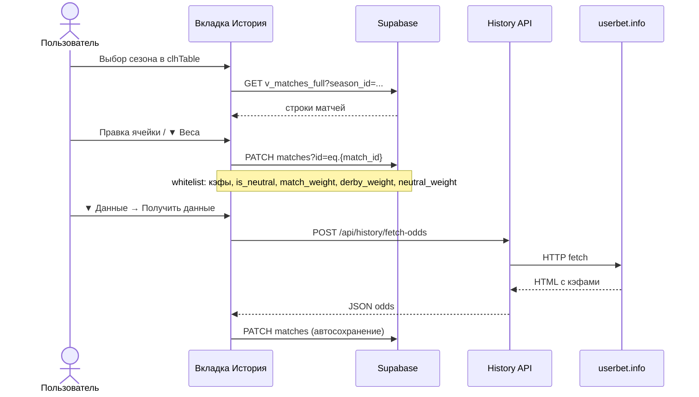
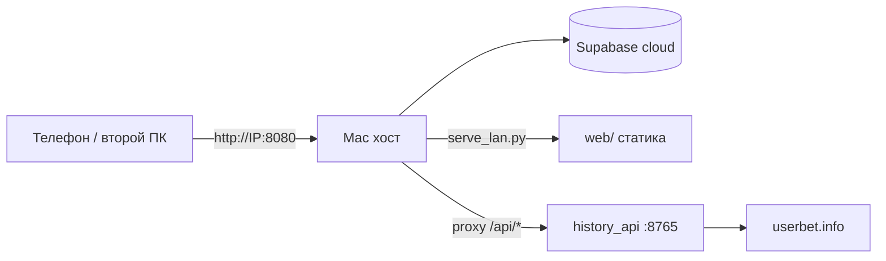

# FairOddsCalc — архитектура

Подробное описание компонентов, потоков данных и различий между **web** и **desktop**.  
Формулы: [calculation.md](calculation.md). API: [reference.md](reference.md). Обучение: [training-and-calculation.md](training-and-calculation.md).

---

## 1. Продукт и клиенты



**FairOddsCalc** строит **согласованную** футбольную линию (1X2, азиатские форы, тоталы, ИТ, точный счёт) из **closing-коэффициентов** одной пуассоновской матрицы счётов.



| Клиент | Файл | Вкладки / режим | Источник матчей для «Линии» |
|--------|------|-----------------|-----------------------------|
| **Web / iOS** | `web/FairOddsCalc_iOS.html` | Линия, Справочник, История, Справка | **Только Supabase** (`v_matches_full`) |
| **Desktop** | `app/fair_odds_calc.py` | + Кальк. A, Рейтинг, Shin, legacy CSV | **CSV** на вкладке «Линия (голы)»; История — Supabase |
| **CLI** | `app/goal_model_train.py` | — | CSV (`load_raw_matches`) |
| **History API** | `app/history_api.py` | — | Прокси userbet для кнопки «Получить данные» |

> В web **отключён** импорт CSV для обучения (закомментирован `gmParseCsv`). Матчи для модели — только из БД.

**Ключи Supabase** — только **anon key** на клиенте (`config/supabase.json`, `web/supabase.config.json`). Service role на клиенте запрещён.

---

## 2. Компонентная схема



| Модуль | Роль |
|--------|------|
| `app/goal_model.py` | Shin de-vig, азиатский settlement, Poisson-матрица, рынки |
| `app/goal_model_train.py` | Обучение: `prepare_matches`, `fit_strength_ratings`, `predict_match`, `base_weight` |
| `app/supabase_history.py` | REST истории, PATCH whitelist, экспорт `matches_to_goal_csv` |
| `app/supabase_teams.py` | REST справочника (`leagues`, `team`) |
| `app/userbet_odds.py` | Парсинг HTML userbet |
| `app/history_api.py` | FastAPI: `/health`, `/api/history/fetch-odds` |
| `web/FairOddsCalc_iOS.html` | UI + JS-порт модели (`gmTrain`, `gmPredict`, …) |

---

## 3. Поток: обучение модели (web)



**Фильтр «полной линии»** (`goalRawHasFullLine`): нужны `closing_ah_home`, `closing_total_line`, AH1/AH2, Over/Under. Без этого матч не попадает в обучение.

**Ключи команд:** `home_team_id` / `away_team_id` (int из Supabase) → строка в модели (`team_key` / `gmTeamKey`). Legacy CSV без id — ключ = имя команды.

---

## 4. Поток: редактирование истории



Подробные маппинги колонок: [reference.md](reference.md).

---

## 5. Вкладки web (актуальные)

| Вкладка | ID | Данные | Действия |
|---------|-----|--------|----------|
| **Линия** | `tab-goal` | Supabase seasons/matches, справочник команд | загрузка, веса сезонов, обучение, прогноз |
| **Справочник** | `tab-teams` | `leagues`, `team` | список команд; логотипы в **localStorage** |
| **История** | `tab-hist` | `v_season_summary`, `v_matches_full`, PATCH `matches` | просмотр, правка кэфов, ▼ Веса, userbet |
| **Справка** | `tab-help` | встроенный текст | дублирует ключевые разделы docs |

**Legacy-панели** в HTML (`#tab-a`, `#tab-rank`, `#tab-shin`, `#legacy-hist`) скрыты; не используются в основном сценарии web.

---

## 6. Desktop vs web — «Линия (голы)»

| Аспект | Web | Desktop |
|--------|-----|---------|
| Загрузка матчей | Supabase «Загрузить из БД» | CSV файл / paste |
| Выбор команд прогноза | `<select>` из **Справочника** (id) | combobox из **ключей обученной модели** |
| Профиль модели | `baseline`: DC on, draw off, S-cal off | все чекбоксы в UI |
| История Supabase | вкладка «История» | отдельная панель + CSV legacy |

---

## 7. Голевая модель — конвейер

```text
closing-линии
  → Shin de-vig (2-way / 1X2)
  → S_m, D_m (infer_total_sum, infer_goal_diff)
  → λ_h, λ_a
  → рейтинг r, H, attack/defense
  → калибровка 1X2 (a,b,c,d; S-cal mode)
  → Poisson P(i,j) [+ Dixon–Coles]
  → [+ модель ничьи, если вкл]
  → 1X2, тоталы, форы, ИТ, топ счётов
```

### Вес матча при обучении

```text
w_base = season_weight × match_weight × neutral_mult
neutral_mult = is_neutral ? neutral_weight : 1.0
```

**Дерби не входит в `w_base`.** `derby_weight = 1` → индикатор `I_derby_home` в регрессии силы и поправка **H** при прогнозе.

Дополнительно (автоматически):

| Этап | Формула |
|------|---------|
| Сила | `w = w_base × w_line_AH × w_Huber` |
| Attack/defense | `w = w_base × w_line_T × w_Huber` |

### Defaults web-профиля `baseline`

| Параметр | Значение |
|----------|----------|
| Dixon–Coles | **вкл** |
| Модель ничьи | **выкл** (`use_draw_model = false`) |
| S-калибровка | **off** (`s_calibration_mode = "off"`) |
| q_min / q_max | 0.95 / 1.05 (legacy); 0.98 / 1.03 (`residual_dc`) |
| α форы / тотала | 0.25 / 0.5 |

Подробнее: [training-and-calculation.md](training-and-calculation.md) §6.

---

## 8. Схема БД

Актуальная ER-схема Supabase (UUID лиги, int id команд/сезонов/матчей): [db-er-closing-lines.md](db-er-closing-lines.md).

---

## 9. Запуск

| Компонент | Команда |
|-----------|---------|
| Desktop | `python3 app/fair_odds_calc.py` |
| Web локально | `cd web && python3 -m http.server 8080 --bind 0.0.0.0` |
| History API | `bash scripts/run_history_api.sh` |
| **LAN (Mac + телефон/ПК)** | `bash scripts/update_and_serve.sh --start` |
| Тесты | `python3 -m pytest tests/ -v` |

Скрипты: [scripts.md](scripts.md).  
Web на iPhone: [ios-preview.md](ios-preview.md).

---

## 10. Диаграмма развёртывания (LAN)



Проверка: `curl http://<IP-Mac>:8080/health` → `{"ok":true}`.
