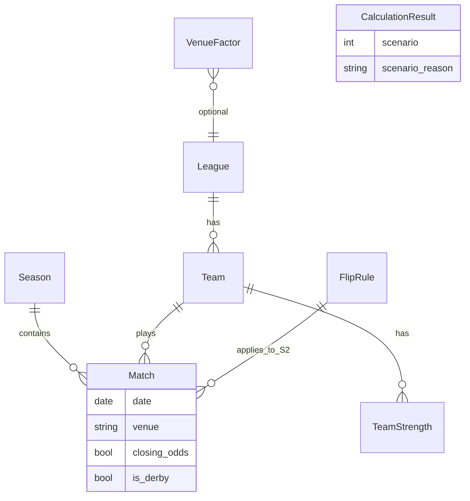

# Модель данных

Сущности, поля, форматы импорта и валидация для калькулятора честных коэффициентов.

Связанные документы: [calculation.md](calculation.md), [scenarios.md](scenarios.md), [examples/](examples/).

---

## 1. Диаграмма сущностей



---

## 2. Сущности

### Season

| Поле | Тип | Обяз. | Описание |
|------|-----|:-----:|----------|
| `id` | string | ✓ | Уникальный идентификатор |
| `name` | string | ✓ | Например «2024/25» |
| `is_current` | bool | ✓ | Текущий сезон |

### League

| Поле | Тип | Обяз. | Описание |
|------|-----|:-----:|----------|
| `id` | string | ✓ | Идентификатор лиги |
| `name` | string | ✓ | Название |

### Team

| Поле | Тип | Обяз. | Описание |
|------|-----|:-----:|----------|
| `id` | string | ✓ | Уникальный идентификатор |
| `name` | string | ✓ | Отображаемое имя |
| `league_id` | string | ✓ | Ссылка на лигу |

### Match

| Поле | Тип | Обяз. | Описание |
|------|-----|:-----:|----------|
| `id` | string | ✓ | Уникальный идентификатор |
| `date` | date (ISO) | ✓ | Дата матча |
| `season_id` | string | ✓ | Сезон |
| `home_team_id` | string | ✓ | Хозяин |
| `away_team_id` | string | ✓ | Гость |
| `venue` | enum | ✓ | `home` \| `away` \| `neutral` — контекст **хозяина** в целевой паре; для нейтрального поля обе стороны используют `neutral` |
| `odds_p1` | decimal | ✓ | Коэффициент P1 |
| `odds_px` | decimal | ✓ | Коэффициент X |
| `odds_p2` | decimal | ✓ | Коэффициент P2 |
| `closing_odds` | bool | ✓ | Закрывающая линия (для цепочки S2) |
| `is_derby` | bool | ✓ | Триггер правила `derby` в S2 |

**Примечание по venue:** для матча в CSV поле `venue` описывает поправку для **home_team** (home/away/neutral). Сила away получает множитель по роли away в этом матче.

### TeamStrength

| Поле | Тип | Обяз. | Описание |
|------|-----|:-----:|----------|
| `team_id` | string | ✓ | Команда |
| `season_id` | string | ✓ | Сезон |
| `market_weight` | decimal | ✓ | Рыночный удельный вес (> 0) |

**Команда C:** при нескольких кандидатах пересечения вес C не обязателен для S1; для отладки может храниться в `TeamStrength` той же лиги.

### VenueFactor

| Поле | Тип | Обяз. | Описание |
|------|-----|:-----:|----------|
| `context` | string | ✓ | `global` или `league_id` |
| `h_home` | decimal | ✓ | Множитель дома |
| `h_away` | decimal | ✓ | Множитель в гостях |
| `h_neutral` | decimal | ✓ | Нейтральное поле |

### FlipRule

| Поле | Тип | Обяз. | Описание |
|------|-----|:-----:|----------|
| `rule_id` | string | ✓ | `derby`, `team_win`, … |
| `condition` | string | ✓ | Код условия (см. [calculation.md](calculation.md) §4b) |
| `coefficient` | decimal | ✓ | k_rule (> 0) |

**Только сценарий 2.**

### TimeWindowConfig

| Поле | Тип | Обяз. | MVP default |
|------|-----|:-----:|-------------|
| `days` | int | ✓ | 90 |
| `min_matches_ac` | int | ✓ | 1 |
| `min_matches_bc` | int | ✓ | 1 |
| `max_odds_age_days` | int | ✓ | 30 |

### IntersectionCandidate

| Поле | Тип | Обяз. | Описание |
|------|-----|:-----:|----------|
| `team_a_id` | string | ✓ | A |
| `team_b_id` | string | ✓ | B |
| `common_opponent_id` | string | ✓ | C |
| `window_days` | int | ✓ | Использованное окно |
| `reliability_score` | decimal | ✓ | 0…1 |
| `selected` | bool | ✓ | Выбран для расчёта |

### CalculationResult

| Поле | Тип | Обяз. | Описание |
|------|-----|:-----:|----------|
| `p1`, `px`, `p2` | decimal | ✓ | Вероятности |
| `k1`, `kx`, `k2` | decimal | ✓ | Коэффициенты |
| `scenario` | int | ✓ | 1 или 2 |
| `scenario_reason` | string | ✓ | Код / текст |
| `common_opponent_id` | string | | C при S2 |
| `margin_level` | int | | 1…5 если применена маржа |

---

## 3. Импорт CSV

### 3.1. matches.csv

| Колонка | Обяз. | Пример |
|---------|:-----:|--------|
| `match_id` | ✓ | m001 |
| `date` | ✓ | 2025-03-15 |
| `season_id` | ✓ | s2024 |
| `home_team_id` | ✓ | team_a |
| `away_team_id` | ✓ | team_c |
| `venue` | ✓ | home |
| `odds_p1` | ✓ | 2.10 |
| `odds_px` | ✓ | 3.40 |
| `odds_p2` | ✓ | 3.60 |
| `closing_odds` | ✓ | true |
| `is_derby` | ✓ | false |

Пример: [examples/matches.csv](examples/matches.csv).

### 3.2. team_strength.csv

| Колонка | Обяз. |
|---------|:-----:|
| `team_id` | ✓ |
| `season_id` | ✓ |
| `market_weight` | ✓ |

### 3.3. venue_factors.csv

| Колонка | Обяз. |
|---------|:-----:|
| `context` | ✓ |
| `h_home` | ✓ |
| `h_away` | ✓ |
| `h_neutral` | ✓ |

### 3.4. flip_rules.csv

| Колонка | Обяз. |
|---------|:-----:|
| `rule_id` | ✓ |
| `condition` | ✓ |
| `coefficient` | ✓ |

---

## 4. Валидация

| Правило | Ошибка |
|---------|--------|
| Уникальность `match_id`, `team_id` | DUPLICATE_ID |
| `odds_*` > 1 | INVALID_ODDS |
| `venue` ∈ {home, away, neutral} | INVALID_VENUE |
| `market_weight` > 0 | INVALID_WEIGHT |
| Дата в формате ISO | INVALID_DATE |
| Для S2-расчёта: наличие FlipRule `derby` при использовании is_derby | WARN_MISSING_DERBY_RULE |

---

## 5. JSON (опционально)

Минимальная структура для экспорта результата:

```json
{
  "match": { "home_team_id": "team_a", "away_team_id": "team_b", "date": "2025-05-20" },
  "scenario": 2,
  "scenario_reason": "S2_OK",
  "common_opponent_id": "team_c",
  "fair": { "p1": 0.504, "px": 0.264, "p2": 0.232 },
  "odds": { "k1": 1.98, "kx": 3.79, "k2": 4.31 }
}
```

---

## 6. Локальное хранение (MVP)

- Импортированные CSV → нормализованные таблицы в локальной БД (SQLite) или файловом хранилище.
- `TimeWindowConfig` и последний `CalculationResult` — в настройках пользователя.

Детали реализации — после выбора стека (см. [mvp-scope.md](mvp-scope.md)).
