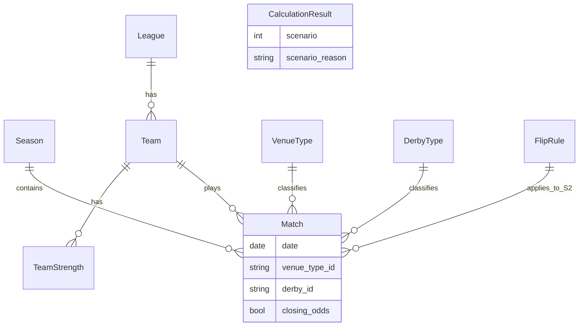

# Модель данных

Сущности, поля, форматы импорта и валидация для калькулятора честных коэффициентов.

Связанные документы: [calculation.md](calculation.md), [scenarios.md](scenarios.md), [examples/](examples/).

---

## 1. Диаграмма сущностей



---

## 2. Сущности

### Season

| Поле | Тип | Обяз. | Описание |
|------|-----|:-----:|----------|
| `id` | string | ✓ | Уникальный идентификатор |
| `name` | string | ✓ | Например «2024/25» |
| `is_current` | bool | ✓ | Текущий сезон |

### League

| Поле | Тип | Обяз. | Описание |
|------|-----|:-----:|----------|
| `id` | string | ✓ | Идентификатор лиги |
| `name` | string | ✓ | Название |

### Team

| Поле | Тип | Обяз. | Описание |
|------|-----|:-----:|----------|
| `id` | string | ✓ | Уникальный идентификатор |
| `name` | string | ✓ | Отображаемое имя |
| `league_id` | string | ✓ | Ссылка на лигу |

### Match

| Поле | Тип | Обяз. | Описание |
|------|-----|:-----:|----------|
| `id` | string | ✓ | Уникальный идентификатор |
| `date` | date (ISO) | ✓ | Дата матча |
| `season_id` | string | ✓ | Сезон |
| `home_team_id` | string | ✓ | Хозяин |
| `away_team_id` | string | ✓ | Гость |
| `venue_type_id` | string | ✓ | Код из справочника **VenueType** (см. ниже) |
| `odds_p1` | decimal | ✓ | Коэффициент P1 |
| `odds_px` | decimal | ✓ | Коэффициент X |
| `odds_p2` | decimal | ✓ | Коэффициент P2 |
| `closing_odds` | bool | ✓ | Закрывающая линия (для цепочки S2) |
| `derby_id` | string | ✓ | Код из справочника **DerbyType** (по умолчанию `no`) |

**Venue Type** и **Derby** — не свободный текст, а коды из справочников (выпадающие списки в Excel). Venue задаёт множители площадки; Derby — тип матча и коэффициент перевертыша в S2.

### DerbyType (справочник)

Справочник типа дерби / соперничества. Импорт: [examples/derby_types.csv](examples/derby_types.csv).

| Поле | Тип | Обяз. | Описание |
|------|-----|:-----:|----------|
| `derby_id` | string | ✓ | Код (ключ справочника) |
| `label_ru` | string | | Подпись в UI (как в Excel) |
| `flip_coefficient` | decimal | ✓ | Множитель перевертыша в **сценарии 2** |
| `applies_flip_s2` | bool | ✓ | Применять ли перевертыш (`false` для `no`) |
| `notes` | string | | Комментарий |

**Допустимые коды (MVP, как в таблице пользователя):**

| derby_id | label_ru (Excel) |
|----------|------------------|
| `no` | No |
| `city_derby` | City derby |
| `regional_derby` | Regional derby |
| `rivalry` | Rivalry |
| `other` | Other |

При `derby_id = no` перевертыш по derby **не** применяется. Коэффициенты `flip_coefficient` настраиваются в справочнике (не в строке матча).

### VenueType (справочник)

Справочник типов площадки / контекста матча. Импорт: [examples/venue_types.csv](examples/venue_types.csv).

| Поле | Тип | Обяз. | Описание |
|------|-----|:-----:|----------|
| `venue_type_id` | string | ✓ | Код (ключ справочника) |
| `label_ru` | string | | Подпись в UI |
| `h_home_team` | decimal | ✓ | Множитель к силе **хозяина** строки |
| `h_away_team` | decimal | ✓ | Множитель к силе **гостя** строки |
| `notes` | string | | Комментарий |

**Допустимые коды (MVP, как в таблице пользователя):**

| venue_type_id | Назначение |
|---------------|------------|
| `regular_home` | Обычный домашний матч хозяина |
| `city_derby_home` | Городское дерби, хозяин дома |
| `regional_derby_home` | Региональное дерби, хозяин дома |
| `neutral` | Нейтральное поле |
| `special` | Особый матч (финал кубка и т.д.) |

При импорте матча значение `venue_type` в пользовательском CSV должно **точно совпадать** с `venue_type_id` из справочника.

### TeamStrength

| Поле | Тип | Обяз. | Описание |
|------|-----|:-----:|----------|
| `team_id` | string | ✓ | Команда |
| `season_id` | string | ✓ | Сезон |
| `market_weight` | decimal | ✓ | Рыночный удельный вес (> 0) |

**Команда C:** при нескольких кандидатах пересечения вес C не обязателен для S1; для отладки может храниться в `TeamStrength` той же лиги.

### FlipRule

| Поле | Тип | Обяз. | Описание |
|------|-----|:-----:|----------|
| `rule_id` | string | ✓ | `team_win`, `team_loss`, … |
| `condition` | string | ✓ | Код условия (см. [calculation.md](calculation.md) §4b) |
| `coefficient` | decimal | ✓ | k_rule (> 0) |

**Только сценарий 2.** Коэффициенты по типу дерби — в справочнике **DerbyType**, не в FlipRule.

### TimeWindowConfig

| Поле | Тип | Обяз. | MVP default |
|------|-----|:-----:|-------------|
| `days` | int | ✓ | 90 |
| `min_matches_ac` | int | ✓ | 1 |
| `min_matches_bc` | int | ✓ | 1 |
| `max_odds_age_days` | int | ✓ | 30 |

### IntersectionCandidate

| Поле | Тип | Обяз. | Описание |
|------|-----|:-----:|----------|
| `team_a_id` | string | ✓ | A |
| `team_b_id` | string | ✓ | B |
| `common_opponent_id` | string | ✓ | C |
| `window_days` | int | ✓ | Использованное окно |
| `reliability_score` | decimal | ✓ | 0…1 |
| `selected` | bool | ✓ | Выбран для расчёта |

### CalculationResult

| Поле | Тип | Обяз. | Описание |
|------|-----|:-----:|----------|
| `p1`, `px`, `p2` | decimal | ✓ | Вероятности |
| `k1`, `kx`, `k2` | decimal | ✓ | Коэффициенты |
| `scenario` | int | ✓ | 1 или 2 |
| `scenario_reason` | string | ✓ | Код / текст |
| `common_opponent_id` | string | | C при S2 |
| `margin_level` | int | | 1…5 если применена маржа |

---

## 3. Импорт CSV

### 3.0. Пользовательская таблица сезона (как в Excel)

Формат для ручного ввода коэффициентов **текущего сезона** — одна строка = один матч. Пример: [examples/season_odds_la_liga_2024_25.csv](examples/season_odds_la_liga_2024_25.csv) (La Liga 2024/25, коэффициенты из таблицы; **Derby** и **Venue Type** на первом этапе проставлены ориентировочно).

| Колонка | Обяз. | Описание |
|---------|:-----:|----------|
| `date` | ✓ | `YYYY-MM-DD` |
| `home_team` | ✓ | Имя хозяина (как в таблице) |
| `p1` | ✓ | Коэффициент P1 |
| `x` | ✓ | Коэффициент X |
| `p2` | ✓ | Коэффициент P2 |
| `away_team` | ✓ | Имя гостя |
| `home_goals` | | Голы хозяев (для сверки / бэктеста, на расчёт fair odds в MVP не влияют) |
| `away_goals` | | Голы гостей |
| `result` | | `H` / `D` / `A` — фактический исход |
| `derby` | ✓ | Код из справочника **DerbyType** (`no`, `city_derby`, …) |
| `venue_type` | ✓ | Код из справочника **VenueType** (выпадающий список в Excel) |

**Маппинг при импорте во внутренний `Match`:**

| Поле CSV | Поле Match |
|----------|------------|
| `home_team` | `home_team_id` (нормализация имени → id) |
| `away_team` | `away_team_id` |
| `p1`, `x`, `p2` | `odds_p1`, `odds_px`, `odds_p2` |
| `derby` | `derby_id` (валидация по справочнику) |
| `venue_type` | `venue_type_id` (валидация по справочнику) |
| — | `season_id` = из настроек импорта (напр. `laliga_2024_25`) |
| — | `closing_odds` = `false` по умолчанию; для цепочки S2 пользователь помечает closing отдельно или вторым импортом |

**Два справочника:** `city_derby` (Derby) и `city_derby_home` (Venue Type) — разные сущности; могут стоять в одной строке матча независимо.

### 3.1. matches.csv (внутренний формат)

| Колонка | Обяз. | Пример |
|---------|:-----:|--------|
| `match_id` | ✓ | m001 |
| `date` | ✓ | 2025-03-15 |
| `season_id` | ✓ | s2024 |
| `home_team_id` | ✓ | team_a |
| `away_team_id` | ✓ | team_c |
| `venue_type_id` | ✓ | regular_home |
| `odds_p1` | ✓ | 2.10 |
| `odds_px` | ✓ | 3.40 |
| `odds_p2` | ✓ | 3.60 |
| `closing_odds` | ✓ | true |
| `derby_id` | ✓ | no |

Пример: [examples/matches.csv](examples/matches.csv).

### 3.2. team_strength.csv

| Колонка | Обяз. |
|---------|:-----:|
| `team_id` | ✓ |
| `season_id` | ✓ |
| `market_weight` | ✓ |

### 3.3. derby_types.csv (справочник Derby)

| Колонка | Обяз. | Описание |
|---------|:-----:|----------|
| `derby_id` | ✓ | Код для выпадающего списка |
| `label_ru` | | Подпись (No, City derby, …) |
| `flip_coefficient` | ✓ | Множитель в сценарии 2 |
| `applies_flip_s2` | ✓ | true/false |
| `notes` | | Комментарий |

Пример: [examples/derby_types.csv](examples/derby_types.csv).

### 3.4. venue_types.csv (справочник Venue Type)

| Колонка | Обяз. | Описание |
|---------|:-----:|----------|
| `venue_type_id` | ✓ | Код для выпадающего списка |
| `label_ru` | | Подпись |
| `h_home_team` | ✓ | Множитель хозяина |
| `h_away_team` | ✓ | Множитель гостя |
| `notes` | | Комментарий |

Пример: [examples/venue_types.csv](examples/venue_types.csv).

> **Устаревшее:** [venue_factors.csv](examples/venue_factors.csv) — упрощённые три множителя `h_home`/`h_away`/`h_neutral`; для новых импортов использовать **venue_types**.

### 3.5. flip_rules.csv

| Колонка | Обяз. |
|---------|:-----:|
| `rule_id` | ✓ |
| `condition` | ✓ |
| `coefficient` | ✓ |

---

## 4. Валидация

| Правило | Ошибка |
|---------|--------|
| Уникальность `match_id`, `team_id` | DUPLICATE_ID |
| `odds_*` > 1 | INVALID_ODDS |
| `venue_type_id` ∉ справочник VenueType | INVALID_VENUE_TYPE |
| `market_weight` > 0 | INVALID_WEIGHT |
| Дата в формате ISO | INVALID_DATE |
| `derby_id` ∉ справочник DerbyType | INVALID_DERBY_TYPE |

---

## 5. JSON (опционально)

Минимальная структура для экспорта результата:

```json
{
  "match": { "home_team_id": "team_a", "away_team_id": "team_b", "date": "2025-05-20" },
  "scenario": 2,
  "scenario_reason": "S2_OK",
  "common_opponent_id": "team_c",
  "fair": { "p1": 0.504, "px": 0.264, "p2": 0.232 },
  "odds": { "k1": 1.98, "kx": 3.79, "k2": 4.31 }
}
```

---

## 6. Локальное хранение (MVP)

- Импортированные CSV → нормализованные таблицы в локальной БД (SQLite) или файловом хранилище.
- `TimeWindowConfig` и последний `CalculationResult` — в настройках пользователя.

Детали реализации — после выбора стека (см. [mvp-scope.md](mvp-scope.md)).
