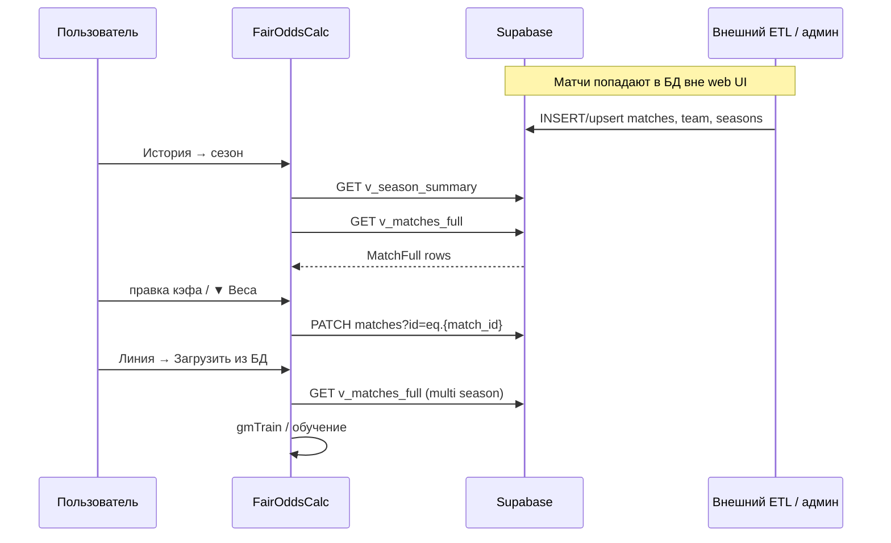
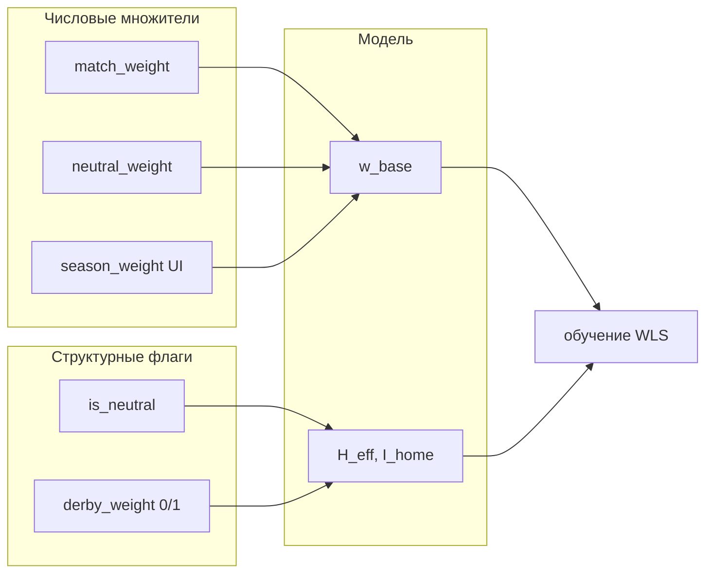

# Схема БД: closing-линии (Supabase)

**Актуальная** схема REST API, используемая вкладками **«История»** и **«Линия»**.  
Клиенты: `app/supabase_history.py`, `app/supabase_teams.py`, `web/FairOddsCalc_iOS.html`.

Связанные документы: [reference.md](reference.md), [architecture.md](architecture.md).

> Старые диаграммы с `team_id = "serie_a:12"` и string PK — **устарели**.  
> В Supabase команды имеют **integer `id`**, лиги — **UUID `id`**.

---

## 1. ER-диаграмма (фактическая)

```mermaid
erDiagram
    leagues ||--o{ team : "leagues_id"
    leagues ||--o{ seasons : "league_id"
    seasons ||--o{ matches : "season_id"
    team ||--o{ matches : "home_team_id"
    team ||--o{ matches : "away_team_id"

    leagues {
        uuid id PK
        string name
    }

    team {
        int id PK
        uuid leagues_id FK
        string name_team
    }

    seasons {
        int season_id PK
        uuid league_id FK
        string season_label
        timestamptz imported_at
    }

    matches {
        int id PK "PATCH filter"
        int match_id "в view v_matches_full"
        int season_id FK
        date match_date
        int home_team_id FK
        int away_team_id FK
        numeric closing_ah_home
        numeric closing_total_line
        numeric ah_home_odds
        numeric ah_away_odds
        numeric over_odds
        numeric under_odds
        numeric home_odds
        numeric draw_odds
        numeric away_odds
        boolean is_neutral
        numeric match_weight
        numeric derby_weight "0 или 1"
        numeric neutral_weight
        string note
    }

    v_season_summary {
        view "агрегат сезонов"
    }

    v_matches_full {
        view "матч + имена команд/лиги"
    }
```

---

## 2. Поток данных (не CSV-импорт в UI)



**В web нет** кнопки «импорт CSV → Supabase». Legacy CSV — скрытая панель `#legacy-hist` (localStorage).  
Экспорт для CLI: `matches_to_goal_csv()` — см. [reference.md](reference.md).

---

## 3. Таблицы и view

### 3.1. `leagues`

| Поле | Тип | Описание |
|------|-----|----------|
| `id` | UUID | PK, `league_id` в API |
| `name` | text | название лиги |

REST: `GET /leagues?select=id,name`

### 3.2. `team`

| Поле | Тип | Описание |
|------|-----|----------|
| `id` | **integer** | PK команды |
| `leagues_id` | UUID | FK → `leagues.id` |
| `name_team` | text | имя в UI |

REST: `GET /team?leagues_id=eq.{uuid}`

**Ключ в модели:** `str(home_team_id)` через `team_key()` / `gmTeamKey()`.

> Локальный `data/teams/registry.json` (`serie_a:12`) — **legacy desktop**, не Supabase.

### 3.3. `seasons` + view `v_season_summary`

| Поле view | Тип | Описание |
|-----------|-----|----------|
| `season_id` | int | PK сезона |
| `league_id` | UUID | лига |
| `season_label` | text | напр. `2024-25` |
| `matches_count` | int | число матчей |
| `imported_at` | timestamptz | дата импорта |

### 3.4. `matches` + view `v_matches_full`

View добавляет: `league_name`, `season_label`, `home_team`, `away_team`.

| Поле | PATCH | Описание |
|------|:-----:|----------|
| `id` | — | PK таблицы; фильтр PATCH |
| `match_id` | — | id в view (= `matches.id`) |
| closing-линия (AH, тотал, 1X2) | ✓ | см. whitelist |
| `is_neutral` | ✓ | нейтральное поле |
| `match_weight` | ✓ | множитель качества |
| `derby_weight` | ✓ | **1** = дерби, **0** = нет |
| `neutral_weight` | ✓ | только при `is_neutral` |
| `note` | — | read-only в PATCH |

Полный whitelist: [reference.md](reference.md).

---

## 4. Флаги vs веса



| Поле | Роль |
|------|------|
| `is_neutral` | **режим**: `I_home=0`, `H_eff=0` |
| `derby_weight` | **факт дерби** → `δ_derby` при обучении, `H_eff` при прогнозе |
| `match_weight` | качество матча (0 = исключить) |
| `neutral_weight` | ослабление **только** при `is_neutral=true` |

```text
w_base = season_weight × match_weight × (is_neutral ? neutral_weight : 1)
```

**Дерби не входит в `w_base`.**

---

## 5. Legacy CSV → поля БД

| CSV / export | Поле БД |
|--------------|---------|
| `value`, `quality_weight` | `match_weight` |
| `neutral_flag` | `is_neutral` |
| `derby_flag` | факт → `derby_weight` 1/0 |
| `quality_flag` | `note` (+ может совпадать с меткой в UI) |
| `home_team_id`, `away_team_id`, `league_id` | id-ключи модели |

Канонический export header: `matches_to_goal_csv()` в `supabase_history.py`.

---

## 6. Сброс флагов дерби

```sql
-- docs/sql/reset_derby_flags.sql
UPDATE matches SET derby_weight = 0 WHERE derby_weight IS NULL OR derby_weight <> 0;
```

Python: `reset_all_derby_flags()` — см. [scripts.md](scripts.md).

---

## 7. Пример строки view

| match_id | home_team_id | home_team | derby_weight | match_weight | is_neutral |
|----------|--------------|-----------|--------------|--------------|------------|
| 1042 | 57 | Inter | 0 | 1.0 | false |
| 1043 | 12 | Roma | 1 | 1.0 | false |

При `derby_weight=1` матч участвует в оценке `δ_derby`; вес строки **не** умножается на дерби.
