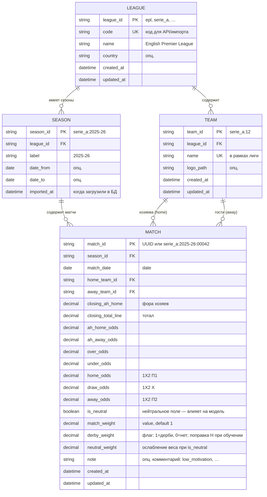
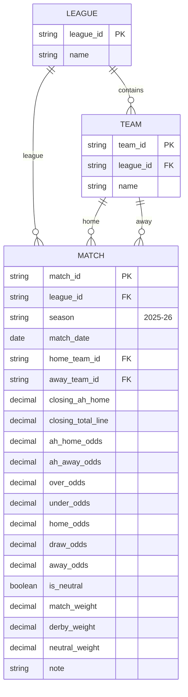
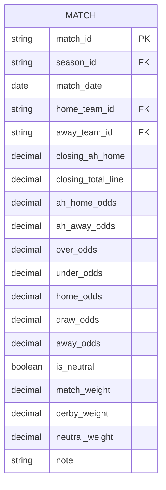
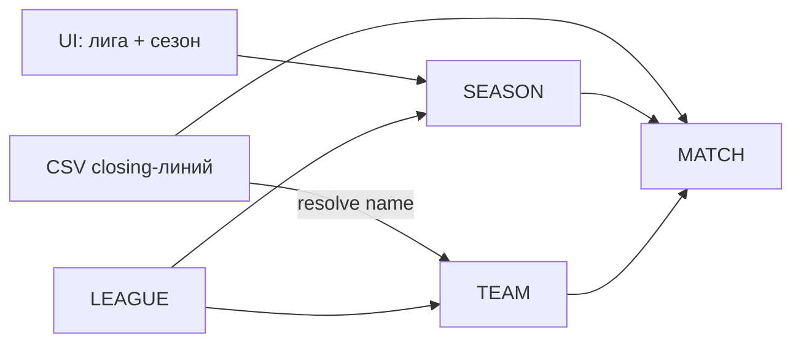

# ER-диаграмма БД: closing-линии (вкладка «История»)

Целевая схема Supabase для closing-линий (вкладки **«История»** и **«Линия»**).

Связанные документы: [architecture.md](architecture.md), [reference.md](reference.md), [../app/goal_model_train.py](../app/goal_model_train.py).

---

## 1. ER-диаграмма (Mermaid)



> **Флаги `neutral_flag` / `derby_flag` / `quality_flag` в CSV — наследие UI.**
> Для БД достаточно весов + одного структурного признака `is_neutral`.
> Подробнее: [§7. Флаги vs веса](#7-флаги-vs-веса-нужны-ли-флаги).

---

## 2. Соответствие столбцам CSV (вкладка «История»)

При сохранении сезона в UI сейчас задаются **лига** и **сезон** отдельно от строк CSV.
В БД лига и сезон — внешние ключи; столбец `league` в CSV при импорте сверяется с `season.league_id`.

| Столбец CSV | Поле в БД | Таблица | Обяз. |
|-------------|-----------|---------|:-----:|
| *(выбор в UI)* | `league_id` | `SEASON` / через `season_id` → `MATCH` | ✓ |
| *(выбор в UI)* | `label` → `season_id` | `SEASON` | ✓ |
| `date` | `match_date` | `MATCH` | |
| `home_team` | `home_team_id` | `MATCH` → `TEAM` | ✓ |
| `away_team` | `away_team_id` | `MATCH` → `TEAM` | ✓ |
| `closing_ah_home` | `closing_ah_home` | `MATCH` | ✓* |
| `closing_total_line` | `closing_total_line` | `MATCH` | ✓* |
| `ah_home_odds` | `ah_home_odds` | `MATCH` | ✓* |
| `ah_away_odds` | `ah_away_odds` | `MATCH` | ✓* |
| `over_odds` | `over_odds` | `MATCH` | ✓* |
| `under_odds` | `under_odds` | `MATCH` | ✓* |
| `home_odds` | `home_odds` | `MATCH` | |
| `draw_odds` | `draw_odds` | `MATCH` | |
| `away_odds` | `away_odds` | `MATCH` | |
| `neutral_flag` | `is_neutral` | `MATCH` | см. §7 |
| `value` | `match_weight` | `MATCH` | default `1` |
| `derby_weight` | `derby_weight` | `MATCH` | **1** = дерби, **0** = нет; влияет на H, не на вес |
| `neutral_weight` | `neutral_weight` | `MATCH` | default `1`; только при `is_neutral` |
| `quality_flag` | `note` | `MATCH` | только метка, не логика |
| ~~`derby_flag`~~ | — | — | **не нужен** в БД (см. §7) |

\* Обязательны для обучения голевой модели (рынки AH + тотал); 1X2 желательны для ничьи.

---

## 3. Описание сущностей

### 3.1. `LEAGUE` — справочник лиг

| Поле | Тип | Ключ | Описание |
|------|-----|------|----------|
| `league_id` | `VARCHAR(32)` | PK | Стабильный код: `epl`, `serie_a`, `la_liga`, … |
| `code` | `VARCHAR(32)` | UK | Дублирует `league_id` или короткий алиас |
| `name` | `VARCHAR(128)` | | Отображаемое название |
| `country` | `VARCHAR(64)` | | Опционально |
| `created_at` | `TIMESTAMPTZ` | | |
| `updated_at` | `TIMESTAMPTZ` | | |

**Сиды:** как в `history_store.LEAGUES` (5 топ-лиг).

### 3.2. `TEAM` — справочник команд

| Поле | Тип | Ключ | Описание |
|------|-----|------|----------|
| `team_id` | `VARCHAR(64)` | PK | Формат `{league_id}:{n}` — как в `team_registry` |
| `league_id` | `VARCHAR(32)` | FK → `LEAGUE` | Лига команды |
| `name` | `VARCHAR(128)` | | Имя в UI и CSV |
| `logo_path` | `VARCHAR(256)` | | Путь к логотипу (опц.) |
| `created_at` | `TIMESTAMPTZ` | | |
| `updated_at` | `TIMESTAMPTZ` | | |

**Ограничения:**
- `UNIQUE (league_id, name)` — одно имя на лигу;
- при импорте CSV имена `home_team` / `away_team` резолвятся в `team_id` через справочник.

### 3.3. `SEASON` — сезон лиги (контейнер импорта)

Соответствует паре **«Лига + Сезон»** на вкладке «История» при нажатии «Сохранить в хранилище».

| Поле | Тип | Ключ | Описание |
|------|-----|------|----------|
| `season_id` | `VARCHAR(64)` | PK | Напр. `serie_a:2025-26` |
| `league_id` | `VARCHAR(32)` | FK → `LEAGUE` | |
| `label` | `VARCHAR(16)` | | `2025-26` (нормализованный) |
| `date_from` | `DATE` | | Начало сезона (опц.) |
| `date_to` | `DATE` | | Конец сезона (опц.) |
| `imported_at` | `TIMESTAMPTZ` | | Время последнего импорта |

**Ограничения:**
- `UNIQUE (league_id, label)`.

### 3.4. `MATCH` — матч с closing-линией

Одна строка CSV = одна запись. `match_id` — суррогатный ключ (не из CSV).

| Поле | Тип | Ключ | Описание |
|------|-----|------|----------|
| `match_id` | `VARCHAR(64)` | PK | UUID или `{season_id}:{seq}` |
| `season_id` | `VARCHAR(64)` | FK → `SEASON` | Сезон из UI |
| `match_date` | `DATE` | | `date` из CSV |
| `home_team_id` | `VARCHAR(64)` | FK → `TEAM` | |
| `away_team_id` | `VARCHAR(64)` | FK → `TEAM` | |
| `closing_ah_home` | `NUMERIC(4,2)` | | Азиатская фора хозяев |
| `closing_total_line` | `NUMERIC(4,2)` | | Линия тотала |
| `ah_home_odds` | `NUMERIC(6,3)` | | |
| `ah_away_odds` | `NUMERIC(6,3)` | | |
| `over_odds` | `NUMERIC(6,3)` | | |
| `under_odds` | `NUMERIC(6,3)` | | |
| `home_odds` | `NUMERIC(6,3)` | | |
| `draw_odds` | `NUMERIC(6,3)` | | |
| `away_odds` | `NUMERIC(6,3)` | | |
| `is_neutral` | `BOOLEAN` | | Нейтральное поле → без домашнего преимущества в модели |
| `match_weight` | `NUMERIC(4,3)` | | Общий множитель обучения (CSV `value`), default `1.0` |
| `derby_weight` | `NUMERIC(4,3)` | default `0` | Флаг дерби: **1** = да, **0** = нет; поправка **H** при обучении |
| `neutral_weight` | `NUMERIC(4,3)` | | Ослабление веса при `is_neutral`, default `1.0` |
| `note` | `VARCHAR(128)` | | Произвольная метка (`low_motivation`, …), **не влияет на расчёт** |
| `created_at` | `TIMESTAMPTZ` | | |
| `updated_at` | `TIMESTAMPTZ` | | |

**Ограничения:**
- `home_team_id <> away_team_id`;
- `UNIQUE (season_id, match_date, home_team_id, away_team_id)` — защита от дублей при повторном импорте;
- индексы: `(season_id)`, `(home_team_id)`, `(away_team_id)`, `(match_date)`.

---

## 4. Упрощённая схема (только то, что запросил пользователь)

Если не выделять `SEASON` в отдельную таблицу, сезон можно хранить полем в `MATCH`:



**Рекомендация:** вариант с таблицей `SEASON` (раздел 1) — он точнее отражает UI «История»
(сохранение пачки матчей по паре лига+сезон) и упрощает перезапись сезона целиком.

---

## 5. Флаги vs веса

### Роли полей (актуальная модель)

| Поле | Тип | Роль |
|------|-----|------|
| `is_neutral` | boolean | **режим матча**: без домашнего преимущества (`H_eff = 0`) |
| `derby_weight` | 0 / 1 | **факт дерби**; при обучении оценивается `δ_derby` для поправки H |
| `match_weight` | число | множитель качества матча (default 1) |
| `neutral_weight` | число | ослабление веса **только** если `is_neutral = true` |

### Вес при обучении

```text
W_обучения = W_сезон × match_weight × neutral_mult
neutral_mult = is_neutral ? neutral_weight : 1.0
```

- `match_weight = 0` — матч не влияет на обучение.
- **Дерби не умножает вес.** `derby_weight = 1` → матч участвует в регрессии силы с индикатором `I_derby_home`.

### Нейтральное поле

**`is_neutral`** — не про вес, а про **геометрию модели**:
на нейтральном поле не применяется домашнее преимущество `H` при восстановлении `D` и в прогнозе.
`neutral_weight` при этом — отдельно: «насколько доверять этому нетипичному матчу при обучении».

### Устаревшие CSV-флаги

| Поле CSV | Сейчас в БД |
|----------|-------------|
| `derby_flag` | `derby_weight` = 1 / 0 |
| `neutral_flag` | `is_neutral` |
| `value`, `quality_weight` | `match_weight` |
| `quality_flag` | `note` + `match_weight` |

### Итоговая схема `MATCH` (без лишних флагов)



**Убрать из целевой БД:** `derby_flag`, `quality_flag` как поля логики.
**Оставить:** `is_neutral` + три числовых веса + опциональный `note`.

---

## 5. Поток импорта (из вкладки «История»)



1. Пользователь выбирает `league_id` и `season` (`label`).
2. Upsert `SEASON` по `(league_id, label)`.
3. Для каждой строки CSV: найти/создать `TEAM` по имени в этой лиге.
4. Insert/upsert `MATCH` с `season_id` и всеми коэффициентами.

---

## 6. Пример записей

**LEAGUE**

| league_id | name |
|-----------|------|
| serie_a | Serie A |

**TEAM**

| team_id | league_id | name |
|---------|-----------|------|
| serie_a:1 | serie_a | Inter |
| serie_a:2 | serie_a | Roma |

**SEASON**

| season_id | league_id | label |
|-----------|-----------|-------|
| serie_a:2025-26 | serie_a | 2025-26 |

**MATCH** (фрагмент)

| match_id | season_id | match_date | home_team_id | away_team_id | closing_ah_home | closing_total_line | home_odds | draw_odds | away_odds |
|----------|-----------|------------|--------------|--------------|-----------------|-------------------|-----------|-----------|-----------|
| …:001 | serie_a:2025-26 | 2025-09-15 | serie_a:1 | serie_a:2 | -0.75 | 3.00 | 1.63 | 4.55 | 4.82 |
