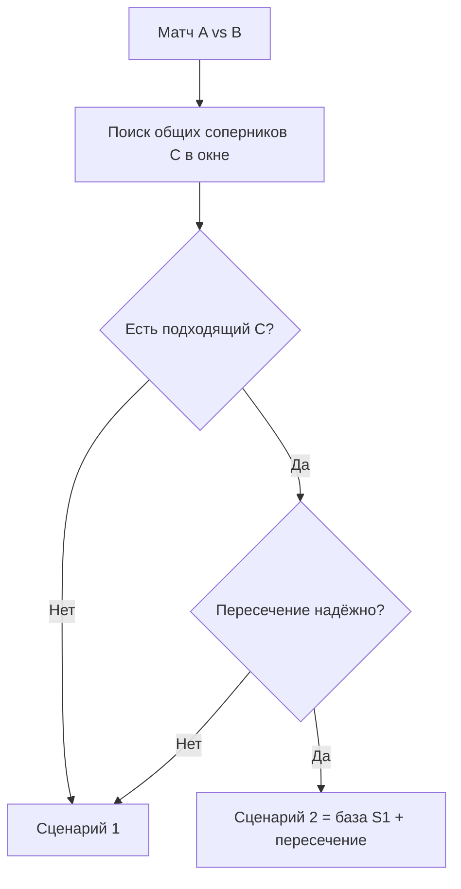
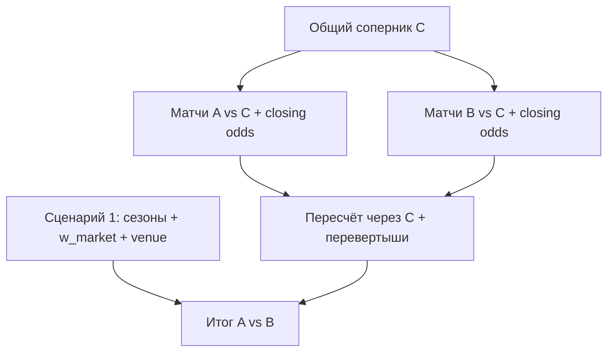

# Сценарии расчёта

Документ фиксирует **раздел 2** исходной спецификации: выбор между сценарием 1 и 2, критерии общего соперника C, надёжность пересечения и состав входов.

Связанные документы: [requirements.md](requirements.md), [calculation.md](calculation.md), [data-model.md](data-model.md).

---

## 1. Обзор

| Сценарий | Код | Кратко |
|----------|-----|--------|
| Без пересечения | **1** | Сезоны + рыночный вес + venue; без FlipRule |
| Через пересечение | **2** | Полный S1 + A–C, B–C + closing + перевертыши + слияние |

**Сценарий 2 не заменяет сценарий 1** — он выполняет полный прогон S1 и накладывает коррекцию через C.

---

## 2. Блок-схема выбора сценария



### Порядок проверок (алгоритм)

1. По всем командам лиги (кроме A и B) найти кандидатов C, с которыми A и B играли в **TimeWindowConfig.days** до даты целевого матча.
2. Отфильтровать **неподходящих** (§3).
3. Для оставшихся вычислить **reliability_score** (§4).
4. Если список пуст → **сценарий 1**, reason: нет подходящего C.
5. Взять кандидата с максимальным score; если score < порога надёжности → **сценарий 1**, reason: ненадёжное пересечение.
6. Иначе → **сценарий 2** с выбранным C.

---

## 3. Критерии «подходящий общий соперник»

Параметры по умолчанию (MVP) задаются сущностью `TimeWindowConfig` и могут переопределяться в UI.

| Параметр | Поле | Значение MVP | Описание |
|----------|------|--------------|----------|
| Временное окно | `days` | **90** | Календарных дней до даты целевого матча |
| Мин. матчей A–C | `min_matches_ac` | **1** | Хотя бы один матч с `closing_odds=true` |
| Мин. матчей B–C | `min_matches_bc` | **1** | Аналогично |
| Свежесть odds | `max_odds_age_days` | **30** | Closing odds не старше N дней от даты матча в цепочке |

### Условия отбраковки кандидата C

- Нет ни одного матча A–C **или** B–C в окне.
- Нет матча с `closing_odds=true` на нужной стороне цепочки.
- Все коэффициенты матча не проходят валидацию (k ≤ 1, пустые поля).
- **v2:** матчи только из прошлых сезонов вне текущего окна — см. [open-questions.md](open-questions.md).

---

## 4. Критерии «ненадёжное пересечение»

После выбора лучшего C выполняется проверка надёжности. При провале — **откат на сценарий 1** (пересечение не применяется, γ = 0 в слиянии; см. [calculation.md](calculation.md), §6).

| Критерий | Порог MVP | Действие |
|----------|-----------|----------|
| Разброс оценок `r_AC` по нескольким матчам A–C | CV > **0.25** | Ненадёжно |
| Разброс оценок `r_BC` по матчам B–C | CV > **0.25** | Ненадёжно |
| Конфликт перевертышей | Два правила на один матч с несовместимым знаком | Ненадёжно |
| Нет валидных de-vig odds | После валидации 0 матчей в цепочке | Ненадёжно |
| Итоговый reliability_score | < **0.5** | Ненадёжно |

**CV (коэффициент вариации):** `σ / μ` для набора оценок относительной силы из матчей одной пары (A–C или B–C).

### reliability_score (MVP)

Нормированная оценка 0…1:

```
score = w1 * min(1, n_AC / 3) * min(1, n_BC / 3)
      + w2 * freshness_factor
      + w3 * (1 - min(1, CV_AC / 0.25)) * (1 - min(1, CV_BC / 0.25))
```

Где `n_AC`, `n_BC` — число валидных closing-матчей; `freshness_factor` — средняя свежесть (1 − возраст/max_odds_age); веса MVP: `w1=0.4`, `w2=0.3`, `w3=0.3`.

Порог надёжности: **score ≥ 0.5**.

---

## 5. Несколько кандидатов C

1. Отсортировать по `reliability_score` по убыванию.
2. При равенстве — выбрать C с **самым свежим** матчем в цепочке (max дата among A–C и B–C).
3. Остальные кандидаты сохраняются в `IntersectionCandidate` с `selected=false` для отладки/UI.

---

## 6. Чеклист входов по сценариям

### Сценарий 1

| Вход | Используется |
|------|:------------:|
| Матчи / коэффициенты прошлого сезона | ✓ |
| Матчи / коэффициенты текущего сезона | ✓ |
| Рыночный удельный вес A, B | ✓ |
| Venue целевого матча A vs B | ✓ |
| Матчи A–C, B–C | ✗ |
| Closing odds цепочки | ✗ |
| FlipRule / дерби | ✗ |

### Сценарий 2

| Вход | Используется |
|------|:------------:|
| Все входы сценария 1 | ✓ |
| Матчи A–C, B–C в окне | ✓ |
| Closing odds цепочки | ✓ |
| Venue каждого матча A–C, B–C | ✓ |
| FlipRule (вкл. `derby`) | ✓ |
| Слияние с оценкой S1 | ✓ |

---

## 7. Тексты scenario_reason для UI

| Код | Пример текста (RU) |
|-----|-------------------|
| `NO_C_IN_WINDOW` | Сценарий 1: нет общего соперника за 90 дней |
| `NO_CLOSING_ODDS` | Сценарий 1: нет закрывающих коэффициентов в цепочке |
| `UNRELIABLE_CV` | Сценарий 1: ненадёжно — большой разброс оценок через C |
| `UNRELIABLE_FLIP_CONFLICT` | Сценарий 1: ненадёжно — конфликт правил перевертыша |
| `UNRELIABLE_LOW_SCORE` | Сценарий 1: ненадёжно — низкий показатель надёжности |
| `S2_OK` | Сценарий 2: пересечение через {имя C} |

---

## 8. MVP vs v2: прошлые сезоны для C

**MVP:** поиск общего соперника только в матчах, попадающих в **текущее календарное окно** (90 дней), без отдельного взвешивания прошлых сезонов.

**v2:** учёт C из прошлых сезонов с decay-весами — [open-questions.md](open-questions.md).

---

## 9. Связь с расчётом



Формулы: [calculation.md](calculation.md), §5–§6.
