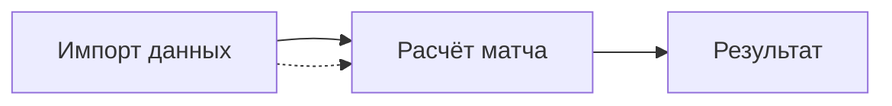

# Спецификация UI (десктоп, MVP)

Описание экранов десктоп-приложения без привязки к конкретному GUI-фреймворку. Реализация — после ревью документации.

Связанные документы: [requirements.md](requirements.md), [calculation.md](calculation.md), [data-model.md](data-model.md).

---

## 1. Принципы

- Офлайн-first, локальные данные.
- Явный индикатор **сценария 1 / 2** и `scenario_reason`.
- Три режима отображения коэффициентов: без маржи, с маржой, таблица.
- Перевертыши и дерби **влияют на расчёт только в сценарии 2**; при S1 — подсказка, не блокировка ввода.

---

## 2. Навигация MVP



Дополнительно (опционально MVP): экран «Настройки» для `TimeWindowConfig` и путей к файлам.

---

## 3. Экран 1: Импорт данных

### Цель

Загрузить и проверить CSV по [data-model.md](data-model.md).

### Элементы

| Элемент | Тип | Описание |
|---------|-----|----------|
| Файл матчей | File picker | `matches.csv` |
| Файл сил | File picker | `team_strength.csv` |
| Справочник Venue Type | File picker | `venue_types.csv` |
| Справочник Derby | File picker | `derby_types.csv` |
| Файл перевертышей | File picker | `flip_rules.csv` |
| Кнопка «Импортировать» | Button | Запуск валидации и сохранения |
| Таблица ошибок | Table | Строка, колонка, код ошибки |
| Счётчик записей | Label | Матчей / команд / правил |

### Поведение

- При успехе — зелёный статус и переход к расчёту (или автоактивация вкладки «Расчёт»).
- При ошибках — импорт отклоняется частично или полностью (MVP: **полный** откат при критических ошибках).

### Wireframe (ASCII)

```
+--------------------------------------------------+
|  Импорт данных                                    |
|  [ matches.csv      ] [ Обзор... ]               |
|  [ team_strength.csv ] [ Обзор... ]              |
|  [ venue_types.csv   ] [ Обзор... ]              |
|  [ derby_types.csv   ] [ Обзор... ]              |
|  [ flip_rules.csv    ] [ Обзор... ]              |
|                    [ Импортировать ]              |
|  Ошибки:                                          |
|  | строка | файл   | код          |              |
|  | 5      | matches| INVALID_ODDS |              |
+--------------------------------------------------+
```

---

## 4. Экран 2: Расчёт матча

### Элементы

| Элемент | Тип | Описание |
|---------|-----|----------|
| Команда A (хозяин) | ComboBox | Список из `Team` |
| Команда B (гость) | ComboBox | |
| Venue Type | ComboBox | Код из справочника: `regular_home`, `city_derby_home`, … |
| Дата матча | DatePicker | Для окна поиска C |
| Окно поиска C (дней) | SpinBox | Default: 90 |
| Derby | ComboBox | Код из справочника: `no`, `city_derby`, …; в S1 не влияет на расчёт |
| Кнопка «Рассчитать» | Button | Запуск `calculate_match` |

### Подсказки

- **Дерби / FlipRule:** «Учитывается только при сценарии 2 (пересечение через общего соперника).»
- Если A = B — кнопка неактивна.

### Wireframe

```
+--------------------------------------------------+
|  Расчёт матча                                     |
|  Команда A: [ Arsenal        v]                   |
|  Команда B: [ Chelsea        v]                   |
|  Venue Type: [ regular_home        v]            |
|  Дата: [ 2025-05-20 ]  Окно C: [ 90 ] дней        |
|  Derby: [ no                    v]               |
|                    [ Рассчитать ]                 |
+--------------------------------------------------+
```

---

## 5. Экран 3: Результат

### Индикатор сценария

| Компонент | Описание |
|-----------|----------|
| Бейдж | «Сценарий 1» (нейтральный) / «Сценарий 2» (акцент) |
| Текст причины | `scenario_reason` на русском |
| Общий соперник | Имя C при S2 |

Пример: `Сценарий 2 · пересечение через Liverpool · надёжность 0.72`

### Режим отображения (radio)

| Значение | Описание |
|----------|----------|
| Без маржи | Честные k после расчёта |
| С маржой | §2 [calculation.md](calculation.md); выбор уровня 1–5 |
| Таблица | Табличный вид 2×3 + подпись режима |

### Уровень маржи (при «С маржой»)

- Radio или slider **1, 2, 3, 4, 5**.
- Подпись: «с маржой **3**%».

### Таблица 2×3

#### Вариант A (MVP по умолчанию): одинаковая линия

Обе строки показывают **одни и те же** коэффициенты линии 1X2 матча **A (home) vs B (away)**.

| | P1 | X | P2 |
|---|-----|-----|-----|
| **{Имя A}** | k1 | kx | k2 |
| **{Имя B}** | k1 | kx | k2 |

Подзаголовок: «Исходы с точки зрения пары: P1 — победа A, P2 — победа B».

#### Вариант B (альтернатива, на ревью): зеркало

| | P1 | X | P2 |
|---|-----|-----|-----|
| **{Имя A}** | k1 | kx | k2 |
| **{Имя B}** | k2 | kx | k1 |

Статус выбора: [open-questions.md](open-questions.md).

### Формат чисел

- Десятичные коэффициенты, **2** знака после запятой.
- Вероятности (опционально во вторичной панели): 3 знака или проценты.

### Wireframe

```
+--------------------------------------------------+
|  [ Сценарий 2 ]  Пересечение через team_c        |
|  Режим: (•) Без маржи ( ) С маржой ( ) Таблица   |
|  Маржа:  --  |  ( )1 ( )2 (•)3 ( )4 ( )5        |
|                                                   |
|           |  P1   |   X   |  P2   |              |
|  Team A   | 1.98  | 3.79  | 4.31  |              |
|  Team B   | 1.98  | 3.79  | 4.31  |              |
|  без маржи                                        |
+--------------------------------------------------+
```

---

## 6. Состояния и ошибки

| Состояние | UI |
|-----------|-----|
| Нет импорта | Блокировка расчёта, ссылка на импорт |
| Расчёт S1 | Бейдж «Сценарий 1» + reason |
| Откат S2→S1 | Бейдж S1 + reason «ненадёжно…» |
| Ошибка данных | Модальное окно с кодом |

---

## 7. Нефункциональные (UI)

- Отклик расчёта < 2 с на типичном объёме MVP (локально).
- Сохранение последней пары команд и режима отображения между сессиями.
- Язык интерфейса: русский.

---

## 8. Вне MVP (UI)

- Тёмная тема.
- Графики динамики коэффициентов.
- Экспорт в Excel.
- Автозагрузка линий букмекеров.

См. [mvp-scope.md](mvp-scope.md).
